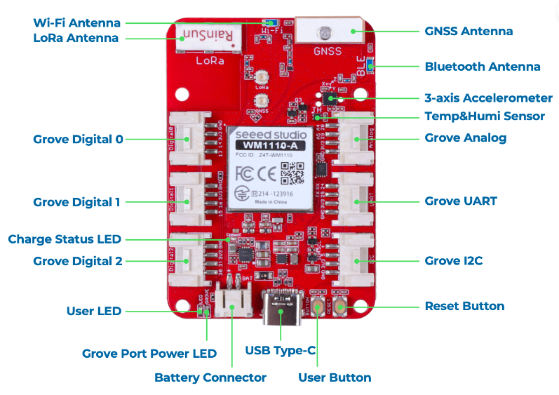

.. _wio_tracker_1110:

Seeed Wio Tracker 1110
################

Overview
********

The Seeed Wio Tracker 1110 Dev Board is a development board for indoor and 
outdoor (GNSS/Wi-Fi/BLE) positioning technology based on the WiO-WM1110 
Wireless Module.

Hardware
********

- Nordic nRF52840 Cortex-M4F processor at 64MHz
- WiO-WM1110 Wireless Module
- P25Q32H (external 4MB QSPI Flash)
- 1x user LED
- 1x charge status LED
- 1x grove port power LED
- USB Type-C Connector, nRF52840 acting as USB device
- 1x user button
- 1x reset button
- Bluetooth antenna
- LoRa antenna
- Wi-Fi antenna
- GNSS antenna
- 3x Grove Digitals
- 1x Grove Analog
- 1x Grove UART
- 1x Grove IIC
- LIS3DHTR (3-axis accelerometer) 
- SHT4x (Temperture&humidity)

Supported Features
==================

The Wio Tracker 1110 board configuration supports the following hardware features:

+-----------+------------+----------------------+
| Interface | Controller | Driver/Component     |
+===========+============+======================+
| ADC       | on-chip    | adc                  |
+-----------+------------+----------------------+
| CLOCK     | on-chip    | clock_control        |
+-----------+------------+----------------------+
| FLASH     | on-chip    | flash, QSPI flash    |
+-----------+------------+----------------------+
| GPIO      | on-chip    | gpio                 |
+-----------+------------+----------------------+
| I2C(M)    | on-chip    | i2c                  |
+-----------+------------+----------------------+
| MPU       | on-chip    | arch/arm             |
+-----------+------------+----------------------+
| NVIC      | on-chip    | arch/arm             |
+-----------+------------+----------------------+
| PWM       | on-chip    | pwm                  |
+-----------+------------+----------------------+
| RADIO     | on-chip    | Bluetooth,           |
|           |            | ieee802154           |
+-----------+------------+----------------------+
| RTC       | on-chip    | system clock         |
+-----------+------------+----------------------+
| SPI(M/S)  | on-chip    | spi                  |
+-----------+------------+----------------------+
| UART      | on-chip    | serial               |
+-----------+------------+----------------------+
| USB       | on-chip    | usb                  |
+-----------+------------+----------------------+
| WDT       | on-chip    | watchdog             |
+-----------+------------+----------------------+

Other hardware features have not been enabled yet for this board.

Connections and IOs
===================

The `SeeedStudio website`_ has detailed information about the board including
`pinouts`_ and the `schematic`_.

LED
---

* LED (blue) = P0.06

Button
------------

* BUTTON = P1.02
* RESET = P0.18

Programming and Debugging
*************************

The Wio Tracker 1110 ship with the `Adafruit nRF52 Bootloader`_ which supports flashing
using `UF2`_. Doing so allows easy flashing of new images, but does not support
debugging the device. For debugging please use `External Debugger`_.

UF2 Flashing
============

To enter the bootloader, connect the USB port of the Wio Tracker to your host, and
double tap the reset botton to the left of the USB connector. A mass storage
device named `Wio Tracker 1110(BOOT)` should appear on the host. Using the command line, or
your file manager copy the `zephyr/zephyr.uf2` file from your build to the base
of the `Wio Tracker 1110(BOOT)` mass storage device. The Wio Tracker 1110 will automatically reset
and launch the newly flashed application.

External Debugger
=================

In order to support debugging the device, instead of using the bootloader, you
can use an :ref:`External Debug Probe <debug-probes>`. To flash and debug Zephyr
applications you need to use `TC2030-CLIP-3PACK Retaining CLIP board`_ or solder 
an SWD header onto the back side of the board.

For Segger J-Link debug probes, follow the instructions in the
:ref:`jlink-external-debug-probe` page to install and configure all the
necessary software.

Flashing
--------

Follow the instructions in the :ref:`jlink-external-debug-probe` page to install
and configure all the necessary software. Then build and flash applications as
usual (see :ref:`build_an_application` and :ref:`application_run` for more
details).

Here is an example for the :ref:`hello_world` application.

First, run your favorite terminal program to listen for output.

.. code-block:: console

   $ minicom -D <tty_device> -b 115200

Replace :code:`<tty_device>` with the port where the board Wio Tracker 1110
can be found. For example, under Linux, :code:`/dev/ttyACM0`.

Then build and flash the application in the usual way. Just add
``CONFIG_BOOT_DELAY=5000`` to the configuration, so that USB CDC ACM is
initialized before any text is printed, as below:

.. tabs::

   .. group-tab:: Wio Tracker 1110

      .. zephyr-app-commands::
         :zephyr-app: samples/hello_world
         :board: wio_tracker_1110
         :goals: build flash
         :gen-args: -DCONFIG_BOOT_DELAY=5000

Debugging
---------

Refer to the :ref:`jlink-external-debug-probe` page to learn about debugging
boards with a Segger IC.

Testing the LEDs in the Wio Tracker 1110
****************************************

There is a sample that allows to test that LEDs on the board are working
properly with Zephyr:

.. tabs::

   .. group-tab:: Wio Tracker 1110

      .. zephyr-app-commands::
         :zephyr-app: samples/basic/blinky
         :board: wio_tracker_1110
         :goals: build flash

You can build and flash the examples to make sure Zephyr is running correctly on
your board. The LED definitions can be found in
:zephyr_file:`boards/arm/wio_tracker_1110/wio_tracker_1110_common.dtsi`.

References
**********

.. target-notes::
.. _Wio Tracker 1110 wiki: https://wiki.seeedstudio.com/Wio-Tracker_Introduction/
.. _Adafruit nRF52 Bootloader: https://github.com/adafruit/Adafruit_nRF52_Bootloader
.. _UF2: https://github.com/microsoft/uf2
